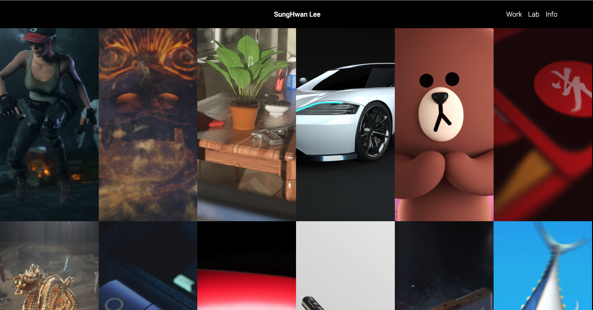
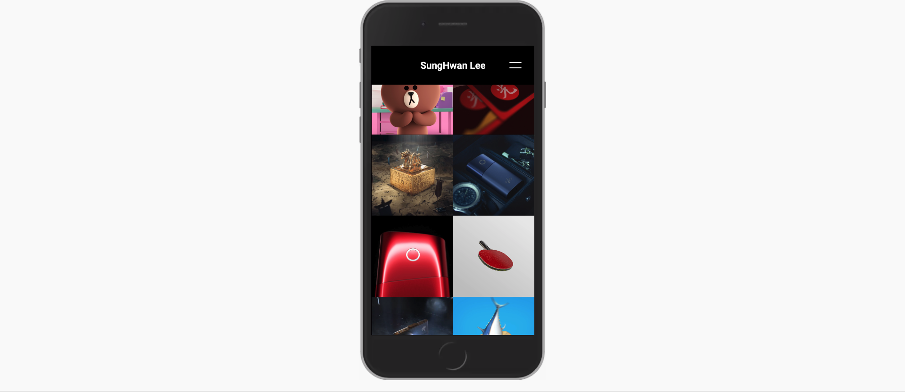

# Shlee Portfolio Server
모션 디자이너 Shlee의 포트폴리오 웹 서버

## 개요
Shlee의 포트폴리오 웹 사이트를 위해 ExpressJS와 Mysql 기반 서버를 구축하였습니다. 호스팅 된 Shlee 웹 사이트는 멀티 페이지 어플리케이션입니다. 

## 기능
* 📺 영상 미리보기: Quick View 버튼을 클릭하면 모달을 통해 영상 미리보기를 제공합니다.
* 💾 프로젝트 상세 보기: 썸네일 클릭으로 각 프로젝트의 상세 페이지로 이동할 수 있습니다.
* ⛴ 상단 네비게이션: 네비게이션을 통해 WORK, LAB, INFO 3개의 하위 페이지로 이동할 수 있습니다. 네비게이션은 스크롤 방향에 따라 나타났다 사라짐을 반복합니다.
* 🎰 무한 스크롤링: 초기에 모든 이미지를 불러오지 않고, 스크롤할 때 이미지를 불러오도록 하였습니다.
* 📱 모바일 대응: 모바일에 적합한 UI를 제공합니다.
### 예정된 변경 사항
* 번들러 적용(Webpack): 진행 중...
* AWS S3 적용